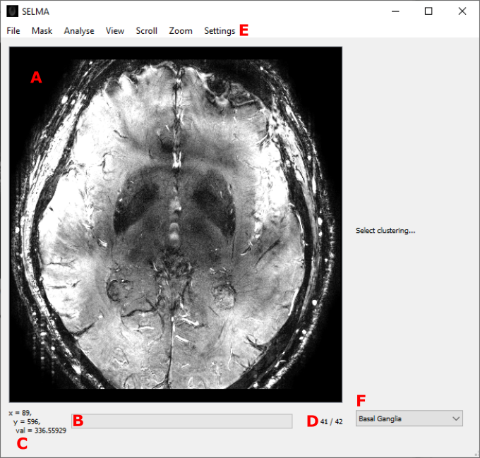

# SELMA
Trial-ready **S**mall Vess**el** MRI **Ma**rkers -- version 0.3.7

The SELMA application is used for extracting and analysing flow information in cerebral vessels. 

**Table of Contents**

- Installation
- Running the program
    - Loading images
    - Viewing images
    - Applying masks
- Explanation of the algorithm
- Settings

# Installation

The program can be installed by cloning this repository. The easiest way of getting (and maintaining) the code is via:
https://desktop.github.com/
A short tutorial on how the software works is available at:
https://help.github.com/en/desktop/getting-started-with-github-desktop

The program can then compiled with any python distribution. The recommended method is to use Anaconda:
https://www.anaconda.com/
Ensure that your python distribution has the same number of bits as your matlab distribution.

In order to run the program, certain packages are needed. These need to be installed in the correct environment.
The easiest way to do this is to create a new Anaconda environment from the selmaEnvironment.yml file.

To do this, launch the 'Anaconda Prompt (Anaconda3)' program, navigate to the directory where the selmaEnvironment.yml file is located, and type the following command:
`conda env create -f selmaEnvironment.yml -n selmaEnvironment`

The environment can then be activated with:
`conda activate selmaEnvironment`

**Installing Matlab dependency**
The program uses some Matlab scripts. In order to run these, python needs to have access to the Matlab engine.
The following instructions are for installations using Anaconda, if you want to run the code in a different way, refer to [this](https://nl.mathworks.com/help/matlab/matlab_external/install-the-matlab-engine-for-python.html) link.

1. Start Anaconda Prompt as an administrator
2. Navigate to `matlabroot/extern/engines/python`, this is probably in: `C:\Program Files\MATLAB\R2020a\extern\engines\python`
3. Make sure the correct environment is activated
4. Run: `python setup.py install`
5. Test if it's working by starting spyder and running: `import matlab.engine`

Once the environment is active, the program can be launched by with either:
*  Typing `python selma.py`
*  Launching Spyder with `spyder` and running it from there.

In the future, SELMA will support installation via Docker.

# Running the program

An overview of the layout of the program. Notable features are:
- A) the image space
- B) the status bar
- C) the cursor hover value 
- D) the frame number
- E) the menu bar

**Loading Dicoms**

A dicom can be loaded via the ‘file’-menu in the menubar, or by pressing Ctrl+O. The Dicom must contain magnitude and velocity or phase frames in order for the analysis to be performed. These can be in any order, but it is assumed that this order is the same for all types, such that each n-th velocity frame can be matched to the n-th magnitude frame.
The program currently supports both enhanced and classic dicoms (Ctrl+Shift+O) acquired on Philips, GE, and SIEMENS machines. Due to inconsistent usage of the DICOM header tags, not all data will immediately work. For more information, consult the developer's guide, section 'DICOM tags'.

Anatomical images can also be loaded via the file menu, or by pressing Ctrl+Alt+O. After selecting the file, the program will interpolate the image in the location of the PCA DICOM. This interpolation will be shown. Switching between viewing the anatomical image and the PCA DICOM can be done by pressing Tab.

**Viewing the Dicom**

After opening a Dicom file, the first of its frames is displayed. The frames can be cycled through by scrolling the mousewheel. The mousewheel can also be used to zoom in and out on the image on the screen if the Control key is pressed. The zoom-action will be centered around the cursor.
Moving and rescaling the image is also possible with the Scroll- and Zoom-menus in the menubar. 
Lastly, the brightness and contrast of the image can be changed by moving the mouse while pressing the middle mouse button. Moving the mouse in the vertical direction changes the brightness, while the horizontal direction changes the contrast. 

**Applying Masks**
The application only reports the analysis of vessels that are contained in a mask. When no mask is supplied, the program will not give any output. Masks can be applied in three different ways:
*  Segmenting -  A mask can be segmented from a T1 dicom by selecting the Segment Mask option from the mask menu in the menubar. A Cat-12 white matter segmentation algorithm is called. This feature is currently only supported for Sagittal T1 volumes. It might take up to 10 minutes to perform the segmentation. 
*  Loading from files - A pregenerated mask can be applied to the image by selecting the ‘Load Mask’ option from the mask menu in the menubar. The program currently supports .png, .npy, and .mat files. Note: not all .mat files work. If the program shows an error message, it might not be the right type of .mat file. Loading the mask in a newer version of Matlab (2019a+) and saving as .mat, might yield the correct filetype.
*  Drawing - A mask can be drawn on top of the currently displayed frame. This is done by pressing the left mouse button and moving the mouse. An exclusion zone can also be drawn when the right mouse button is pressed instead. Drawing in this way can add/subtract on any existing mask.

After a mask is obtained, it can be easily removed by drawing a large exclusion zone around it, or via the Clear Mask function in the mask menu. It can also be saved via the Save Mask function. 

# Explanation of Algorithm

The next step is the analysis. This can be run via the Analyse Vessels function in the Analyse menu. It can take a few minutes to perform the analysis. The current version of the program (0.3.7) doesn't have multithreaded support, so it might appear as if the program is frozen. Even if the operating system warns that the program might be stuck, please allow a few (up to 5) minutes to pass before shutting it down.

The details of the algorithm are more thoroughly described in this work: https://doi.org/10.1002/mrm.26821. Here, a short description of the steps is given.

The steps are:
0. Subtract background
1. Determine SNR
2. Find all voxels with significant flow
3. Remove zero-crossing voxels
4. Remove Ghosting artifacts
5. Remove outer edge
6. Apply mask
7. Find all voxels with significant magnitude
8. Cluster voxels based on significant flow & magnitude
9. Remove non-perpendicular vessels
10. Report data of selected voxels

**Subtract background**
The background of the velocity-frames is obtained by applying a median filter with a very large diameter. It is then subtracted from the velocity-frames in order to center the flow data of the vessels around zero. This median filter takes a long time and is the biggest contributor to the operating time of the algorithm.

**Determine SNR**
First the velocity frames are converted to phase frames. Next, the phase and magnitude frames are converted to a complex signal from which the standard deviation in the real and imaginary component are calculated. Next, the root mean square of these standard deviations is obtained and a median-filter is applied. Next, the SNR in the magnitude frames is found. Lastly, the SNR in the velocity frames is calculated.

**Find all voxels with significant flow**
Using this SNR, all voxels are compared against a sigma that can be set by the user (see Settings). Any voxels whose absolute SNR is larger, is counted as having significant flow.

**Remove zero-crossing voxels**
From these initial significant voxels, all those whose flow does not change direction along the time-axis (i.e. crosses zero), are kept. 

**Remove Ghosting artifacts**
When switched on in the settings, this step finds the largest 'bright' (with high flow) vessels and creates a 'ghosting-zone' around them. Any significant voxels that fall within these zones, are discarded. The various parameters of the method can be changed in the settings window.

**Remove outer edge**
When switched on, a large exclusion zone in the form of a band of a user-defined width is formed around the edge of the image. Any significant voxel that falls within this zone is discarded. Note: this should be changed to a band around the edge of the brain, not the edge of the image.

**Apply mask**
All significant voxels that fall outside of the user-defined mask are discarded.

**Find all voxels with significant magnitude**
In much the same way as step 2, all voxels are tested for significance based on their magnitude. 

**Cluster voxels based on significant flow & magnitude**
All significant-flow voxels are first divided based on their magnitude values (significant positive / negative or not). For each of the six categories (2x flow, 3x magnitude) the voxels are clustered. 

**Remove non-perpendicular vessels**
When switched on in the settings, all voxel-clusters (assumed to be vessels) are either kept or discarded based on the shape of the cluster. Depending on some user-defined parameters, the vessels are judged on whether they are perpendicular to the imaging direction. If not, they are discarded.

**Report data of selected voxels**
For each of the vessels that has not been ruled out in previous steps, the velocity, magnitude etc. of each frame is collected and saved to a .txt file. 

# Settings

The Settings window can be accessed via the settings menu. 

